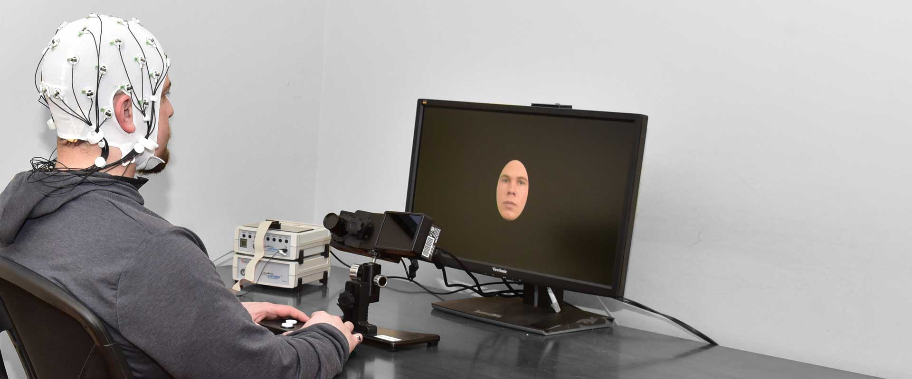

\pagestyle{fancy}
\lhead{}
\fancyhead[R]{UCL Linguistics Short Courses 2024}

Eye-tracking has become an increasingly popular tool in psychology and is now gaining significant traction in psycholinguistics as well. While it does not directly measure neural activity, eye-tracking offers valuable insights into cognitive processes, including attention, language comprehension, and decision-making.

**Course Overview:**

Over the next few weeks, we will explore the fundamentals of eye-tracking and its applications in research on both reading and spoken language processing.

- Week 1: Introduction to the human visual system and the eye-tracking method
- Week 2: Reading
- Week 3: Spoken language processing in a visual context
- Week 4: Eye-tracking with electroencephalography (EEG) and functional magnetic resonance imaging (fMRI)
- Week 5: Demo experiment / Considerations in experiment designs

This course will equip you with a foundational understanding of how eye-tracking is used to study human cognition, especially in the context of language processing. 

# The basics of eye-tracking

## The human visual system

Human vision begins with the eye collecting and filtering light from the environment. This light energy is projected onto the **retina**, a layer at the back of the eye, where it is converted into neural signals by specialized receptor cells. These receptor cells, however, are not evenly distributed across the retina.

The photoreceptors responsible for detailed vision in well-lit conditions, known as **cones**^[Humans have two types of photorecepters, called **cones** and **rods**. Cones are good at visual details and colours, while rods are responsible for low-light vision and night vision.], are densely concentrated in a small central area of the retina called the **fovea**. The fovea is where vision is the clearest or sharpest, in other words, this is where **visual acuity** is the highest. Importantly, only a small part of the visual field (about 1-2 degrees) is processed by the fovea at any given moment, meaning that sharp, detailed vision is limited to this narrow area.

Outside the fovea, visual acuity declines rapidly. This decrease in detail means we must continuously move our eyes, shifting our gaze to different locations in our visual field to maintain clear and accurate perception of our surroundings.

## Types of eye movements

Eye movements are generally classified into three main types: **fixations**, **saccades**, and **smooth pursuit**.

**Fixation** occurs when the gaze is held steady on a single location, allowing the brain to process visual information in detail^[During fixation, the eyes are not completely still but exhibit small movements called microsaccades and ocular drifts. These subtle movements prevent sensory adaptation (when neurons stop responding to stimuli because there's no change in the stimuli), helping the retina maintain sharp visual perception.].

**Saccades** are rapid, ballistic movements that shift the gaze from one point to another, aligning the fovea with the saccade target. Once initiated, saccades follow a pre-determined path that cannot be altered mid-movement (and that's why it's considered ballistic). Regular eye movements typically alternate between fixations and saccades.

**Smooth pursuit**, or simply pursuit, is a specialized eye movement that allows the eyes to track a moving object smoothly^[According to one theory, smooth pursuit evolved as an adaptation for hunting, enabling us to track moving prey continuously]. 

Modern eye-trackers can automatically classify these eye movements in real-time during data collection. Researchers can then choose to analyze specific types of eye movements depending on the focus of their study.

## Modern eye-tracking techniques

The device used to track eye movements is called an **eye tracker**, and it operates using one of two primary techniques: those that measure the position of the eye relative to the head^[These include techniques such as electrooculography (EOG) and scleral search coil. The former involves measuring the skin's electric potential differences (similar to electrocardiography) around the eyes, while the latter involves attaching a search coil on a contact lens. Although older, these techniques still have some applications in today's science. For example, EOG can be used in the evaluation of some neurodegenerative disorders.], and those that measure the orientation of the eye in space (the point of regard). The latter measurement is typically used when the concern is the identification of elements in a visual scene and is the more relevant one to language research. 

The most widely used type of eye tracker in laboratory settings today is the video-based corneal reflection eye tracker^[All eye trackers in the Chandler House labs are of this type.]. These devices use a light source, typically infrared, to create a reflection on the cornea. By measuring the relationship between this corneal reflection and the center of the pupil, the eye tracker can separate head movement from eye movement, providing an accurate measure of the point of regard.

<!-- {width=45%} -->

{width=50%}

{width=45%}

Eye tracking is the measurement of eye movements, but modern eye trackers can often provide more data than that. A good example is pupil size. Although not part of eye movements, pupil size is closely associated with various psychological constructs such as arousal, emotion, cognitive load, and memory. The measurement of pupil size is called pupillometry, and is being used in psychology-related research fields including language. 

Outside the laboratories, eye-tracking techniques have evolved to enable eye-tracking using cameras incorporated in laptops, cell phones, VR headsets, and glasses. These techniques are being applied in academic research as well as in industries such as marketing and video gaming. With minimal training, eye movements can also serve as an input method to control electronic devices. This is being applied in products such as Apple’s Vision Pro. 

# Eye-tracking and visual attention

Eye movements are closely linked to visual attention, which plays a crucial role in helping us selectively process the vast amount of information around us. By tracking eye movements, researchers can effectively "follow" the observer’s attention, gaining insights into what the observer is focusing on and processing at any given moment.

While eye movements and shifts in visual attention are highly correlated, they are not identical. Visual attention doesn't always stay at the center of our visual field. For example, when planning a saccade, attention is often directed to the saccade target briefly before executing the movement. Additionally, we can deliberately focus on things in our parafoveal or peripheral vision without shifting our gaze.

Despite these nuances, under natural and unconstrained circumstances, there is typically a strong link between where we direct our gaze and where our attention is focused, making eye movements a valuable window into cognitive processes [@richardson2004eye]. 

How are these coupled mechanisms of attention and eye movement deployed when a scene is viewed? First, fixations usually center on interesting or informative areas of an image, while blank or uniform areas are usually uninspected. Wooding and colleagues collected real-life eye movement data from a large number of participants viewing artworks in a public museum, and discovered that fixations are not spread evenly or randomly over the stimulus images, but cluster into regions of interest according to the features of the stimulus [@wooding2002eye] (Figure \ref{wooding-fig2}). Regions of interest are determined by both bottom-up factors such as spatial frequency and contrast, and top-down factors such as the viewer's knowledge, memory, beliefs, or goals. 

{width=65%}

# Eye-tracking in language research

## Reading

{width=45%}

Reading is one of the most prominent instances where vision is essential for language comprehension, making eye-tracking a widely utilized method in reading research.

During the reading process, a saccade typically spans about seven to nine letter spaces. When fixation on an individual word, the fixation usually lands between the beginning and the middle of a word. The likelihood of a word being fixated on depends on several factors, including the word’s part of speech (content words tend to be fixated on more than function words) and its length. While fixating on a word, readers also gather information about the surrounding words. This perceptual span generally extends about 18 letters—approximately 3-4 letters to the left and 14-15 letters to the right (for languages written from left to right).

Fixation patterns during reading is influenced by various factors, including the legibility of the text and the syntactic and conceptual difficulty of the material. Although readers typically move their eyes forward, some saccades are regressive, meaning they move backward. These regressive saccades often indicate processing difficulties during reading.

Eye tracking has significantly deepened our understanding of how comprehenders process language during reading. These studies can be divided into different levels: research on reading single words, sentences, and research on reading and comprehending a whole text or multiple texts. 

Eye-tracking in reading also has many practical applications in educational psychology, such as identifying successful and struggling students and diagnosing reading disorders such as dyslexia.

## Spoken language processing with visual contexts

{width=45%}

The use of eye tracking as a tool for studying spoken language comprehension was pioneered by Roger Cooper in 1974. He discovered that listeners initiated saccades toward pictures whose labels were mentioned in spoken stories. 

In 1995, Tanenhaus and colleagues introduced what is known as the visual world paradigm. In this experimental setup, participants view a visual display of objects while either receiving instructions to interact with those objects or listening to sentences for comprehension.

Data analysis in the visual world paradigm typically involves examining the proportion of fixations over time for each object in the visual display. The underlying assumption connecting word recognition and eye movements is that the activation of an object's label influences the likelihood that a participant shifts their attention to that object, resulting in a saccadic eye movement to fixate on it. This paradigm offers a quasi-continuous measure of cognitive processes with fine temporal resolution, significantly enhancing our understanding of the time course of language comprehension in visual contexts. 

## Combining eye-tracking and neuroimaging

Recently, developments in technology and data analysis methods have started to allow researchers to co-register eye movements and electroencephalography (EEG)^[Electroencephalography (EEG) measures the brain's electrical activity ("brain waves") from the scalp. EEG has high temporal resolution and can measure neural activity on the millisecond scale. In cognitive neuroscience and related fields, researchers are often interested in the brain's response to a stimulus. The brain's response relative to the onset of an event (e.g. presentation of a stimulus) is called Event-related potentials (ERPs).] or functional magnetic resonance imaging (fMRI)^[Magnetic resonance imaging uses nuclear magnetic resonance to produce detailed images of body tissues. (Basically it measures the distribution of hydrogen in the body and uses it to calculate images.) Functional MRI (fMRI) uses a version of these MR signals and measures the brain's neural activity by measuring changes in the brain's blood flow associated with neural activities. fMRI's high spatial resolution enables researchers to ask very detailed "where" questions on the millimeter scale (e.g. is there an area in the brain that's specialized in syntax/semantics?). ] data. In this case, eye-tracking can open up new opportunities for these neuroimaging techniques and allow them to measure neural activity in highly natural tasks. Here, eye movements provide information on what is being looked at, and EEG or fMRI data provide information on the brain's response to that visual information. Co-registration of eye-tracking and EEG was pioneered in the first decade of this century, and studies of eye-tracking EEG co-registration during natural reading started to publish in the 2010s. Using eye movement patterns as an anchor, researchers have successfully replicated in natural reading a few ERP effects (e.g. effect of expected vs. unexpected words) in fixation-related potentials (FRPs) that were previously only possible to obtain with carefully-controlled laboratory stimuli presentation methods [@dimigen2011coregistration]. Co-registration of eye-tracking and fMRI has also been possible since the 2010s, with applications to language research emerging in recent years on topics such as syntactic parsing and lexical activation during natural reading. For example, Carter et al. @carter2019linguistic reported that a word's different types of predictability (syntactic, semantic, and lexical) are associated with different regions in the brain's language system. 

{width=45%}

{width=45%}

# Further readings {-}

Richardson, D. C., & Spivey, M. J. (2004). Eye tracking: Research areas and applications. *Encyclopedia of biomaterials and biomedical engineering*, 573, 582.

Carter, B. T., & Luke, S. G. (2020). Best practices in eye tracking research. *International Journal of Psychophysiology*, 155, 49-62.