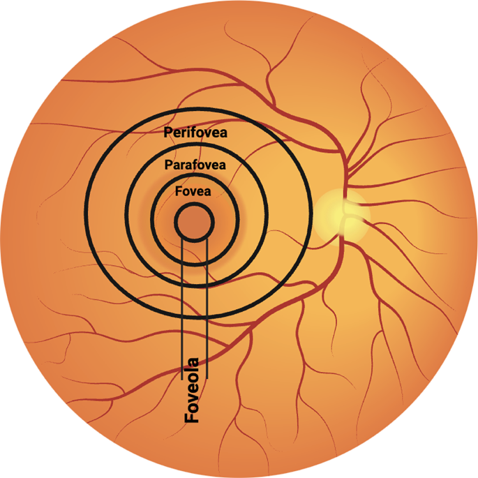
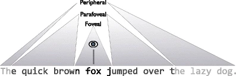
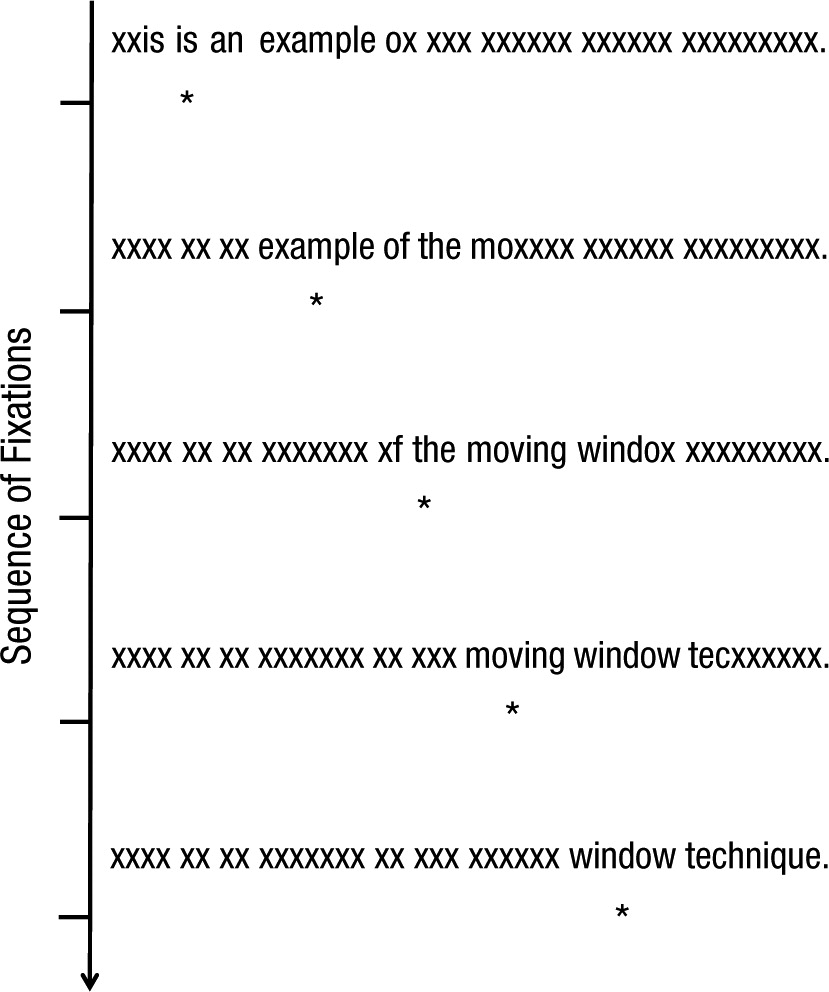
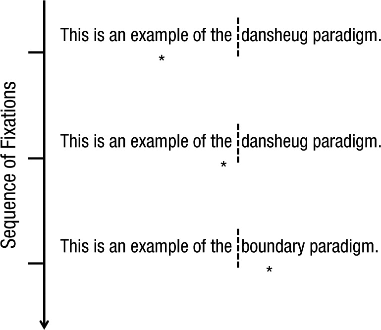

\pagestyle{fancy}
\lhead{}
\fancyhead[R]{UCL Linguistics Autumn School 2023}

# Eye movements in reading: fundamental characteristics

Someone with no knowledge of eye movements may have the impression that during reading, the eye sweeps across the text continuously; this impression is of course an illusion. Like in unconstrained scene-viewing, eye movements in reading consist of a series of fixations and saccades. 

> - On average, a fixation during reading lasts 200-250ms.
> - With each saccade during reading, the eye gaze usually moves about 7 to 9 letters for readers of English. 
> - During reading, about 10-15% of saccades go backwards (*regressive saccades*).
> - *Return sweeps* refers to the eye movement from the end of one line to the beginning of the next. They usually start from 5-7 letters before the end of a line to 3-7 letters after the beginning of the next line. 
> - There are considerable individual differences in terms of average fixation duration and saccade length in reading. 

You may have noticed that saccade length is measured in letter spaces rather than viewing angles in reading. This is because saccade length during reading is relatively unaffected by the retinal size of the text: the eye moves about 7-9 letters with each saccade regardless of whether the text is 36cm to the eye or 72cm (or size 36 or size 72). 

Eye movements are not exactly the same across different writing systems. For example, readers of Chinese (where a character corresponds to a morpheme) typically move their eyes about 2 characters with a saccade; and readers of Japanese (where a character corresponds to a morpheme (*kanji*) or a syllable (*kana*)) have an average saccade length of 3.5 characters. In Hebrew, where vowels are often not represented orthographically, the average saccade length is also shorter than in English (5.5 characters/letters vs. 7-9 letters). The difference in saccade length across languages can be attributed to the difference in information density: while a word is on average 5 letters in English, it is about 2 characters in Chinese and Japanese. When the number of words is considered rather than the number of letters/characters, the average saccade lengths in English, Chinese, Japanese, and Hebrew are roughly comparable [@schotter2015work]. 

> Common measures you may see in a reading eye-tracking experiment^[Although some try to link these different measures with distinct cognitive processing; e.g. some researchers argue that first fixation duration reflects earlier-occurring processes (i.e., word recognition), and gaze duration reflects later-occurring processes (i.e., integration), it is not possible to fully distinguish the different processes with these measures [@cook2017using]. You should pay attention to what the researchers are reporting as well as how they interpret it when reading a paper.]:
>
> On the word level:
>
> - First-fixation duration: the duration of the first fixation on a word.
> - Single-fixation duration: those cases where only a single fixation is made on a word. 
> - Gaze duration: the sum of all fixations on a word prior to moving to another word. 
> - Probability of skipping: the probability that the reader does not fixate on a word/region when moving from left to right across a text (if language is written left-to-right). 
> 
> On the region of interest (ROI) level:
> 
> - First-pass duration: the amount of time from when a reader first fixates on a region to when they first leave that region.
> - Go-past duration/Regression path duration: the amount of time from when a reader first fixates on a region to when they first leave that region to the right (if language is written left-to-right). 
> - Second-pass duration: the sum of all refixations on a region of text after the eye has already moved past that region in the text. 
> - Total duration: the sum of initial processing of a target region (i.e., first-pass duration) and any subsequent rereading of that region (i.e., second-pass duration). 

# Eye movements in reading: more details

## Foveal vs. parafoveal vision in reading

The fovea is where visual acuity is the highest and vision the sharpest, but it is not the only region on the retina where information can be obtained. During scene perception, it has been shown that information of all levels can be processed parafoveally (i.e. information can be obtained from the parafovea, the region that circumscribes the fovea), from low-level features such as colour and orientation to high-level information such as semantic meaning (the gist of a scene). 

{width=30%}

{width=50%}

### Experimental paradigms

A type of experimental paradigm that has been very successful in investigating foveal vs. parafoveal vision in reading is called the gaze-contingency paradigm, in which the visual display changes depending on where the reader is looking. Here are some main types of this paradigm.

#### Moving window/moving mask paradigms {-}

How do foveal and parafoveal visions contribute to reading? A clever way to investigate this is to dissociate these two types of vision in the laboratory. In the moving window paradigm, valid information is only provided within a window area around the gaze location, with the text outside the window replaced by other letters. Conversely, in the moving mask paradigm, foveal letters are masked while only letters in the parafovea and the periphery are retained. 

{width=35%}

{width=50%}

#### Boundary paradigm {-}

In the boundary paradigm, a target word is replaced by a preview word while the reader fixates on the prior parts of the text. When the reader's eye passes an invisible boundary, the preview changes to the target. If the target is processed faster (i.e. shorter fixation times) when the preview is related compared with when it was unrelated, there has been a preview benefit. 

{width=40%}

### Perceptual span in reading

Perceptual span refers to the area from which readers can obtain useful information. An abundance of studies have investigated the size of perceptual span during reading, mainly using the moving window/moving mask paradigm. The perceptual span is asymmetrical around the centre of fixation. In English, the perceptual span during reading is about 3 to 4 letters to the left of the current fixation and 14 to 15 letters to the right, i.e. from the beginning of the current word to 2 words to the right. In languages written right-to-left, the perceptual span is reversed [@schotter2015work]. 

#### Foveal vs. parafoveal vision within the perceptual span {-}

Results from moving mask experiments have shown that foveal processing is vital in reading while parafoveal processing is beneficial but also has limitations. When the moving mask is small enough to allow some letters into the fovea, participants read at a reduced rate but can still obtain information. As the size of the mask increases, reading efficiency drops rapidly. When the mask covers the entire fovea but only some of the parafovea, readers make large numbers of errors when reporting the sentence. 

While parafoveal vision has many limitations, the boundary paradigm has shown that quite a few types of information can be processed parafoveally during reading. Preview benefits can be obtained from previews that overlap with the target word in terms of orthography [@balota1985interaction], phonology [@pollatsek1992phonological], as well as morphology (especially in languages such as Chinese where morphological structure plays a more important role in word recognition)[@yen2008eye]. 

## The control of eye movement in reading

### Where to move the eyes {-}

When we finish processing a word during reading, we make a saccade to move our gaze to the next position. This is quite an automatic process that is controlled by a few non-linguistic as well as linguistic factors. 

In languages with interword spaces such as English, word length (of the fixated word and the next word) and interword space are the most important factors affecting a saccade's landing site. Some evidence also shows that readers of languages that usually do not have interword spaces (e.g. Thai) may benefit from added spaces between words. 

There is a preferred viewing location at which the eyes typically land in a word, which is halfway between the beginning of the word and the middle of the word. Landing at a nonoptimal position in a word (as a result of experimental manipulation) results in longer reading time once the word is fixated. 

Words are sometimes skipped during reading. Skipped words are not left unprocessed but are usually processed in parafoveal vision. The chance of skipping a word is associated with word length (shorter words are skipped more), context constraint (highly predictable words are skipped more), and word frequency (frequent words are skipped more). 

### When to move the eyes {-}

When we move on to the next word during reading (i.e. the fixation duration of the current word) is strongly related to the difficulty of processing the fixated word. Processing difficulty is influenced by linguistic variables such as word frequency, word predictability, number of meanings, age of acquisition, semantic relation between the fixated word and prior words, and word familiarity. 

The effect of linguistic variables on fixation duration is influenced by task. For example, when the participant is tasked to search for a particular word in a text, the effect of word frequency on fixation duration becomes very small; while the same effect of word frequency is exaggerated when the task is to proofread or detect spelling errors. 

Results from disappearing text experiments (where the fixated word disappears or is masked a short time after it is fixated) show that readers only need 50-60ms to get the visual information necessary to identify the fixated word. Therefore, it seems that readers normally spend much longer time fixating on a word than what's needed for extracting visual information (i.e. more processing happens during a fixation than simply extracting visual information). 

# Sentence processing during reading

To understand a text, recognizing the words is only the first step. The reader must also analyze the grammatical structure of each sentence and identify each word's place in this structure (*syntactic parsing*), as well as combine the meaning of individual words and phrases to construct a representation of the sentence's overall meaning (*semantic interpretation*). 

In general, syntactic parsing and semantic interpretation are quick and effortless during reading, in fact as readers, we are usually unaware of these processes. However, by introducing difficulties in these processes and causing sentence processing to break down, we can get insight into how the sentence processing system works. For example, consider (\ref{reduced-relative}): 

```{=latex}
\begin{exe}
\ex
\label{reduced-relative}
The horse raced past the barn fell. 
\end{exe}
```

This sentence is difficult to understand, as the initial interpretation of the verb *raced* is ambiguous: it can be the main verb, or the beginning of a reduced relative clause that modifies *horse*. The parser (the reader) usually tends to initially interpret the verb *raced* as the main verb, but this analysis leaves no place in the sentence for the verb *fell*, at which point the parser has to go back and reinterpret *raced*. This type of sentence that has an attractive initial syntactic analysis that turns out to be wrong is called a *garden path* sentence. Garden path sentences as well as other types of sentences that introduce processing difficulty have been popular tools in the sentence processing literature. Today we will introduce a few core questions in sentence processing and how eye-tracking evidence has contributed to these questions. 

## Sentence processing vs. visual word recognition

Is there a separate visual word recognition system that this system delivers an output that becomes the input to the system or systems that perform syntactic parsing and semantic interpretation (as sentence-processing researchers sometimes assume)? Or is word recognition itself affected by a word's syntactic and semantic context? Clear evidence shows that the resolution of lexical ambiguity is affected by context (e.g. context helps the reader determine whether *bank* denotes a financial institution or the edge of a river) [@duffy1988lexical]. But what about more usual cases where there is no lexical ambiguity? 

Consider the word *oven* in (\ref{oven}). *Oven* is much more predictable in (\ref{oven1}) than (\ref{oven2}). If word recognition is affected by context, then *oven* should be easier to recognize in (\ref{oven1}) than (\ref{oven2}). It is established that there is a logarithmic relationship between reading time and a word's predictability: reading time is a negative linear function of log predictability [@smith2013effect] (the more predictable a word is, the less time is spent on reading it). 

```{=latex}
\begin{exe}
\ex
\label{oven}
\begin{xlist}
\ex
\label{oven1}
The woman took the warm cake out of the oven and frosted it. \\
\ex
\label{oven2}
The woman walked over to the oven and opened it. \\
\end{xlist}
\end{exe}
```

Does this mean that word recognition is affected by the context? It is worth pointing out that the effect of predictability on reading time doesn't *have to* be seen as an effect on the process of word recognition itself. To show this we turn to a factor that has been shown to reliably affect word recognition: word frequency; the more frequent a word is, the easier it is to recognize [@rayner1996eye]. If predictability also affects word recognition, then these two effects might interact: the difference in reading time between frequent vs. infrequent words may be smaller when the words are highly predictable, and larger when the words are unpredictable. If we manage to find an interaction, then we'll have support for an effect of predictability on word recognition. However, evidence suggests that these two effects on reading time are additive rather than interactive: even when predictability is high, the effect of word frequency is not attenuated [@ashby2005eye]. Therefore, the effect of predictability on reading time may not necessarily be on word recognition itself, but rather *postlexical*, after a word has already been identified. 

In sum, it remains unclear whether context information has an effect on the process of visual word recognition itself. 

## Incrementality in sentence processing

One of the first questions to ask about sentence processing is whether syntactic and semantic interpretations are *incremental*, i.e., whether we interpret each word as soon as it is recognized, or we wait till the end of a clause/sentence. On the one hand, processing sentences on a word-by-word basis may be an efficient way to use our time; on the other hand, attempting to interpret a sentence before the end may lead to more errors. 

The last few decades of research have provided abundant evidence that sentence processing is indeed incremental, that there is no measurable lag between recognizing a word and attempting to integrate it into a sentence-level syntactic analysis as well as semantic interpretation. 

Eye-tracking evidence has been very important in establishing the incrementality of sentence processing. For example, Frazier and Rayner @frazier1982making presented participants with sentences such as (\ref{frazier-rayner}). Frazier's garden path theory predicts that upon encountering *a mile*, the parser should initially interpret it as the object of *jogs*. In (\ref{frazier-rayner1}) this turns out correct, but in \ref{frazier-rayner2} this turns out to be wrong when *seems* is encountered. Frazier and Rayner found that immediately upon encountering the word *seems* in (\ref{frazier-rayner2}), readers' eye fixations increased in their duration, and readers were also more likely to make a regressive saccade to an earlier region of the sentence. This suggests that by the time readers encountered the word *seems*, they had already committed to one analysis of the sentence (jogs a mile), which in the case of (\ref{frazier-rayner2}) happened to be the incorrect one. 

```{=latex}
\begin{exe}
\ex
\label{frazier-rayner}
\begin{xlist}
\ex
\label{frazier-rayner1}
Since Jay always jogs a mile this seems like a short distance to him. \\
\ex
\label{frazier-rayner2}
Since Jay always jogs a mile seems like a short distance to him. \\
\end{xlist}
\end{exe}
```

In terms of semantic interpretation, it has been found that the plausibility of a word as a sentence continuation affects eye movements. Implausibility cannot affect eye movements until the reader has actually constructed, or at least entertained, an implausible semantic interpretation; thus the timing of implausibility effects sheds light on how long it takes to integrate a word into a representation of the sentence's meaning. For example, Rayner et al. @rayner2004effect compared reading times on a critical word (e.g. *carrots*) and subsequent material when the word is plausible vs. anomalous:

```{=latex}
\begin{exe}
\ex
\label{rayner2004}
\begin{xlist}
\ex
\label{rayner2004-1}
John used a knife to chop the large carrots for dinner. \\
\ex
\label{rayner2004-2}
John used a pump to inflate the large carrots for dinner. \\
\end{xlist}
\end{exe}
```

Results showed increased gaze duration/first-pass duration when the target word was anomalous vs. plausible. The early effect of syntactic anomaly (as soon as the reader's first fixation(s), which is around 300ms) suggests that within this time span, the reader has not only extracted a great deal of lexical information from the fixated word, but has also at least begun the process of integrating that word into a representation of the sentence's structure and meaning. 

Overall, sentence processing is shown to be highly incremental. 

## Serial vs. parallel processing

We have concluded that sentence processing is highly incremental, but does the processing system only construct one syntactic analysis and semantic interpretation at a time? Or can the system entertain multiple analyses simultaneously? 

A serial model of sentence processing holds that at any moment, the system maintains only a single analysis of a sentence, and if that analysis is proven incorrect, a new analysis will take its place. Some serial models of sentence processing include Frazier's garden path model [@frazier2016sentence], the ACT-R-based parser [@lewis2013activation], and the rational left-corner parser model [@hale2011rational]. A parallel model of sentence processing, on the other hand, holds that the system may maintain multiple analyses at the same time, with different analyses varying in their degree of activation. In case of ambiguity, more than one analysis of the ambiguous material is constructed and will remain in a state of indecision until clearly disambiguating material is encountered. Models that hold this view include the constraint-based approach to sentence comprehension [@macdonald1994lexical] and the surprisal model [@levy2008expectation]. Some models of sentence processing such as the unrestricted race model [@van2000unrestricted] have a hybrid view, where several analyses race to be constructed at a point of ambiguity, while ultimately only one analysis finally "wins". 

The field has more or less favoured parallel models (constraint-based models) in the past few decades, as these models allow that syntactic parsing may not be deterministic (comprehenders constructing different analyses on different occasions), which is supported by abundant evidence (for an intuitive example, it is not difficult for a reader to get the two readings of (\ref{traxler2}) at the same time) [@satub2015reading]. Further, parallel models allow room for nonstructural factors to play a role in syntactic parsing: for example, the verb *remember* tends to be followed by a direct object (*remembered the story*) while the verb *suspect* tends to be followed by a sentence complement (*He suspects the story is false.*). These lexical biases have been shown to affect syntactic parsing rather quickly [@trueswell1993verb]. 

However, one important observation poses some challenges for parallel models: syntactic ambiguity itself doesn't seem to be costly in terms of reading time [@clifton2008parallelism]. Although ambiguity often results in a higher probability of regressive saccades, reading is generally not disrupted by syntactic ambiguity itself. In fact, there is evidence that some globally ambiguous sentences are actually read faster than their unambiguous counterparts (\ref{traxler2} is read faster than \ref{traxler1}) [@traxler1998adjunct]:

```{=latex}
\begin{exe}
\ex
\label{traxler}
\begin{xlist}
\ex
\label{traxler1}
The car of the driver with the moustache was pretty cool. \\
\ex
\label{traxler2}
The son of the driver with the moustache was pretty cool. \\
\end{xlist}
\end{exe}
```

As multiple structural analyses compete in parallel models, processing difficulty should be the highest in fully ambiguous sentences where there is roughly equivalent support for different readings (\ref{traxler2}), and difficulty should be the lowest in unambiguous sentences with only one possible reading. This should in turn predict longer reading time in ambiguous vs. unambiguous sentences, which is contrary to the empirical observations. However, proponents of parallel models have also proposed versions of parallel models that are in fact able to account for the ambiguity advantage [@green2006absence]: at least in some parallel models, processing difficulty is not necessarily introduced by the ambiguous input (*moustache* in (\ref{traxler2})), but rather by the competition between a prior interpretation bias and the new interpretation bias introduced by new input (*fell* in (\ref{reduced-relative}) and *seems* in (\ref{frazier-rayner2})). Since (\ref{traxler2}) does not contain such bias-flipping input, processing difficulty does not necessarily need to occur. 

Returning to the issue of nonstructural factors in syntactic parsing, some recent elaborations of serial models [@van2014evidence] hold that parsing decisions are probabilistic rather than deterministic, thus allowing for the participation of nonstructural factors in forming the single fully constructed interpretation. 

# Summary

Today we have looked at properties of eye movements in reading and how eye movements can help us understand sentence processing in reading. We have introduced some eye-tracking experiment paradigms that are used to study the perceptual span in reading and the mechanism of the control of eye movements during reading. On the sentence level, we have discussed how eye-tracking evidence has helped establish the incrementality of sentence processing and provided important evidence in the debate about whether sentence processing is serial or parallel. 

# Read more on this... {-}

Rayner, K. (1998). Eye movements in reading and information processing: 20 years of research. *Psychological bulletin*, 124(3), 372.

Staub, A. (2015). Reading sentences: Syntactic parsing and semantic interpretation. *The Oxford handbook of reading*, 202-216.