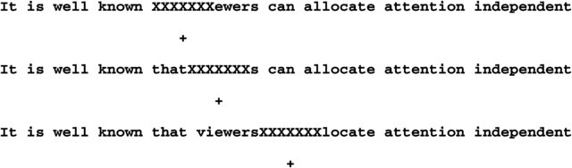

\pagestyle{fancy}
\lhead{}
\fancyhead[R]{UCL Linguistics Short Courses 2024}

# Basic patterns

Someone with no knowledge of eye movements may have the impression that during reading, the eye sweeps across the text continuously; this impression is of course an illusion. Like in unconstrained scene-viewing, eye movements in reading consist of a series of fixations and saccades. 

- On average, a fixation during reading lasts 200-250ms.
- With each saccade during reading, the eye gaze usually moves about 7 to 9 letters for readers of English. 
- During reading, about 10-15% of saccades go backwards (*regressive saccades*).
- *Return sweeps* refers to the eye movement from the end of one line to the beginning of the next. They usually start from 5-7 letters before the end of a line to 3-7 letters after the beginning of the next line. 
- There are considerable individual differences in terms of average fixation duration and saccade length in reading. 

You may have noticed that saccade length is measured in letter spaces rather than viewing angles in reading. This is because saccade length during reading is relatively unaffected by the retinal size of the text: the eye moves about 7-9 letters with each saccade regardless of whether the text is 36cm to the eye or 72cm (or size 36 vs. 72). 

Eye movements are not exactly the same across different writing systems. For example, readers of Chinese (where a character corresponds to a morpheme) typically move their eyes about 2 characters with a saccade; and readers of Japanese (where a character corresponds to a morpheme (*kanji*) or a syllable (*kana*)) have an average saccade length of 3.5 characters. In Hebrew, where vowels are often not represented orthographically, the average saccade length is also shorter than in English (5.5 characters/letters vs. 7-9 letters). The difference in saccade length across languages can be attributed to the difference in information density: while a word is on average 5 letters in English, it is about 2 characters in Chinese and Japanese. When the number of words is considered rather than the number of letters/characters, the average saccade lengths in English, Chinese, Japanese, and Hebrew are roughly comparable [@schotter2015work]. 

# Sources of information during reading

The fovea is where visual acuity is the highest and vision the sharpest, but it is not the only region on the retina where information can be obtained. During scene perception, it has been shown that information of all levels can be processed parafoveally (i.e. information can be obtained from the parafovea, the region that circumscribes the fovea), from low-level features such as colour and orientation to high-level information such as semantic meaning (the gist of a scene). 

![Photograph of the retina of the human eye, with overlay diagrams showing the positions and sizes of the macula, fovea, and optic disc. Extract from [@zaydon2024abcs]. \label{parafovea}](img/parafovea.png){width=40%}

## Perceptual span in reading

Perceptual span refers to the area from which readers can obtain useful information. An abundance of studies have investigated the size of perceptual span during reading, mainly using the moving window/moving mask paradigm. The perceptual span is asymmetrical around the centre of fixation. In English, the perceptual span during reading is about 3 to 4 letters to the left of the current fixation and 14 to 15 letters to the right, i.e. from the beginning of the current word to 2 words to the right. In languages written right-to-left, the perceptual span is reversed [@schotter2015work]. 

#### Foveal vs. parafoveal vision within the perceptual span {-}

Results from moving mask experiments have shown that foveal processing is vital in reading while parafoveal processing is beneficial but also has limitations. When the moving mask is small enough to allow some letters into the fovea, participants read at a reduced rate but can still obtain information. As the size of the mask increases, reading efficiency drops rapidly. When the mask covers the entire fovea but only some of the parafovea, readers make large numbers of errors when reporting the sentence. 

While parafoveal vision has many limitations, the boundary paradigm has shown that quite a few types of information can be processed parafoveally during reading. Preview benefits can be obtained from previews that overlap with the target word in terms of orthography [@balota1985interaction], phonology [@pollatsek1992phonological], as well as morphology (especially in languages such as Chinese where morphological structure plays a more important role in word recognition)[@yen2008eye]. 

{width=60%}

## Experimental paradigms

A type of experimental paradigm that has been very successful in investigating foveal vs. parafoveal vision in reading is called the gaze-contingency paradigm, in which the visual display changes depending on where the reader is looking. Here are some main types of this paradigm.

#### Moving window/moving mask paradigms {-}

How do foveal and parafoveal visions contribute to reading? A clever way to investigate this is to dissociate these two types of vision in the laboratory. In the moving window paradigm, valid information is only provided within a window area around the gaze location, with the text outside the window replaced by other letters. Conversely, in the moving mask paradigm, foveal letters are masked while only letters in the parafovea and the periphery are retained. 

<!-- ```{=latex}
\begin{figure}
\centering
\begin{minipage}{.4\textwidth}
  \centering
  \includegraphics[width=.5\linewidth]{img/moving-window.png}
  \caption{The moving window paradigm.}
  \label{moving-window}
\end{minipage}%
\begin{minipage}{.6\textwidth}
  \centering
  \includegraphics[width=.5\linewidth]{img/moving-mask.jpg}
  \caption{The moving mask paradigm. }
  \label{moving-mask}
\end{minipage}
\end{figure}
``` -->

{width=60%}

{width=60%}

#### Boundary paradigm {-}

In the boundary paradigm, a target word is replaced by a preview word while the reader fixates on the prior parts of the text. When the reader's eye passes an invisible boundary, the preview changes to the target. If the target is processed faster (i.e. shorter fixation times) when the preview is related compared with when it was unrelated, there has been a preview benefit. 

{width=60%}

<!-- ## The control of eye movement in reading

### Where to move the eyes {-}

When we finish processing a word during reading, we make a saccade to move our gaze to the next position. This is quite an automatic process that is controlled by a few non-linguistic as well as linguistic factors. 

In languages with interword spaces such as English, word length (of the fixated word and the next word) and interword space are the most important factors affecting a saccade's landing site. Some evidence also shows that readers of languages that usually do not have interword spaces (e.g. Thai) may benefit from added spaces between words. 

There is a preferred viewing location at which the eyes typically land in a word, which is halfway between the beginning of the word and the middle of the word. Landing at a nonoptimal position in a word (as a result of experimental manipulation) results in longer reading time once the word is fixated. 

Words are sometimes skipped during reading. Skipped words are not left unprocessed but are usually processed in parafoveal vision. The chance of skipping a word is associated with word length (shorter words are skipped more), context constraint (highly predictable words are skipped more), and word frequency (frequent words are skipped more). 

### When to move the eyes {-}

When we move on to the next word during reading (i.e. the fixation duration of the current word) is strongly related to the difficulty of processing the fixated word. Processing difficulty is influenced by linguistic variables such as word frequency, word predictability, number of meanings, age of acquisition, semantic relation between the fixated word and prior words, and word familiarity. 

The effect of linguistic variables on fixation duration is influenced by task. For example, when the participant is tasked to search for a particular word in a text, the effect of word frequency on fixation duration becomes very small; while the same effect of word frequency is exaggerated when the task is to proofread or detect spelling errors. 

Results from disappearing text experiments (where the fixated word disappears or is masked a short time after it is fixated) show that readers only need 50-60ms to get the visual information necessary to identify the fixated word. Therefore, it seems that readers normally spend much longer time fixating on a word than what's needed for extracting visual information (i.e. more processing happens during a fixation than simply extracting visual information).  -->

# Reading eye movement measures

Common measures you may see in a reading eye-tracking experiment^[Although some try to link these different measures with distinct cognitive processing; e.g. some researchers argue that first fixation duration reflects earlier-occurring processes (i.e., word recognition), and gaze duration reflects later-occurring processes (i.e., integration), it is not possible to fully distinguish the different processes with these measures [@cook2017using]. You should pay attention to what the researchers are reporting as well as how they interpret it when reading a paper.]:

On the word level:

- **First-fixation** duration: the duration of the first fixation on a word.
- **Single-fixation** duration: those cases where only a single fixation is made on a word. 
- **Gaze duration**: the sum of all fixations on a word prior to moving to another word. 
- **Probability of skipping**: the probability that the reader does not fixate on a word/region when moving from left to right across a text (if language is written left-to-right). 

On the sentence / region of interest (ROI) level:

- **First-pass** duration: the amount of time from when a reader first fixates on a region to when they first leave that region.
- **Go-past** duration/**Regression path** duration: the amount of time from when a reader first fixates on a region to when they first leave that region to the right (if language is written left-to-right). 
- **Second-pass** duration: the sum of all refixations on a region of text after the eye has already moved past that region in the text. 
- **Total duration**: the sum of initial processing of a target region (i.e., first-pass duration) and any subsequent rereading of that region (i.e., second-pass duration). 

# Eye movements and language processing: Word recognition

Research has shown that reading time on the word level is influenced by a variety of factors, including word frequency, word familiarity, age of acquisition, lexical ambiguity, and contextual plausibility. These factors are believed to impact the process of word recognition (as opposed to later processes such as interpretation or integration), as reflected in early eye movement measures such as first fixation, single fixation, and gaze duration. 

#### Word Frequency and Length {-}

One of the most well-documented factors affecting reading time is **word frequency**: the more frequent a word is, the less time readers spend processing it [@just1980theory]. However, word frequency is often confounded with **word length** in natural language, since longer words tend to appear less frequently. Even when controlling for word length, word frequency continues to significantly impact reading time. For example, Rayner's research indicates that the size of the frequency effect is 20–40 ms in first fixation duration and 30–90 ms in gaze duration [@rayner1986lexical; @inhoff1986parafoveal].

Interestingly, the frequency effect diminishes with repetition: after a word is encountered a few times in a passage, the difference in reading time between frequent and infrequent words becomes negligible by the third instance [@rayner1995eye].

#### Word Familiarity and Age of Acquisition {-}

Independently, **word familiarity** has been shown to have an impact on reading times, as well, with readers spending less time on more familiar words [@williams2004eye; @chaffin2001learning]. In addition, **age-of-acquisition** can affect how long it takes to process a word, and thus has an effect on reading times, as shown by Juhasz and Rayner [@juhasz2003investigating; @juhasz2006role]. 

#### Lexical Ambiguity {-}

The presence of **lexical ambiguity**—when a word has multiple meanings—can further influence reading times. Words that are balanced in ambiguity (i.e., where multiple meanings are equally likely, for example *coach*) tend to be read more slowly than unambiguous words or biased ambiguous words (those with a clear dominant meaning, for example *bark*) [@sereno2006eye].

#### Morpheme frequency {-}

There is evidence that readers decompose words into their constituent morphemes while reading. Research shows that the **frequency of individual morphemes** affects reading times independently of overall word frequency [@pollatsek2005role; @hyona1998reading; @andrews2004eye]. This effect occurs not only with transparent compound words (e.g., punishment = punish+ment), but also with opaque compounds (e.g., casualty $\neq$ casual+ty), suggesting that readers may routinely decompose compound words, even when it doesn’t aid in lexical processing [@pollatsek2005role].

#### Contextual constraint {-}

Finally, the time spent reading a word is also influenced by the **context** in which it appears. A substantial body of research has demonstrated that words which are predictable from the preceding context are read more quickly than less predictable words [e.g., @ehrlich1981contextual; @rayner2004effects; @smith2013effect]. However, some researchers argue that this reduction in reading time may not necessarily reflect differences in the word recognition process itself. Instead, it may be due to *post-lexical* processes, such as integrating the word's meaning into the broader context of the sentence [@ashby2005eye].

# Eye movements and language processing: Sentence processing

To fully comprehend a text, word recognition is just the initial stage. The reader must also process the grammatical structure of each sentence, identifying how each word fits into this structure—a process known as syntactic parsing. Additionally, the reader must integrate the meanings of individual words and phrases to form a coherent representation of the sentence's overall meaning, a process referred to as semantic interpretation.

#### Incrementality of sentence processing {-}

We often don’t realize it, but human language processing occurs at remarkable speed. One key factor that enables this is our ability to process language input incrementally—that is, we interpret words and structures as we encounter them, without waiting for the end of the sentence. This holds true for both syntactic parsing and semantic interpretation. Frazier and Rayner [@frazier1982making] were the first to demonstrate this through reading eye-tracking. They found that sentences like (\ref{seem2}) induced processing difficulties compared to (\ref{seem1}), as evidenced by longer fixations on the disambiguating region (bold).

```{=latex}
\begin{exe}
\ex
\label{seem}
\begin{xlist}
\ex
\label{seem1}
Since Jay always jogs a mile and a half this \textbf{seems like} a very short distance to him. \\
\ex
\label{seem2}
Since Jay always jogs a mile and a half \textbf{seems like} a very short distance to him.  \\
\end{xlist}
\end{exe}
```

The prolonged fixations on the disambiguating region suggest that, when reading (\ref{seem2}), the reader—despite knowing the sentence hasn't ended—has already committed to (or strongly preferred) a specific syntactic analysis of the sentence (namely, interpreting "a mile and a half" as the object of "jogs"). When this interpretation turns out to be incorrect, the reader experiences difficulty at the disambiguating region, as the sentence structure conflicts with their initial parsing.

Sentences like (\ref{seem2}) and (\ref{reduced-relative}), which initially present an appealing but incorrect syntactic analysis, are known as **garden path sentences**. These sentences have been a popular tool to study how humans comprehend language. 

```{=latex}
\begin{exe}
\ex
\label{reduced-relative}
The horse raced past the barn fell. 
\end{exe}
```

#### What we learn from difficulties {-}

In general, syntactic parsing and semantic interpretation occur rapidly and effortlessly during reading, so much so that we are typically unaware of these processes. However, when these processes encounter difficulties and sentence comprehension breaks down, we gain valuable insights into the workings of the sentence processing system. In the previous section, we've illustrated garden path sentences and how the difficulties they induce help us understand sentence processing. 

But processing difficulties during reading are very diverse. Next, let's see an example of another type of difficulty (difficulty in reference resolution) has helped us understand the way readers use syntactic constraints during comprehension. 

In a classic study about the time course of sentence comprehension, Sturt [@sturt2003time] tested whether reflexive resolution is guided by grammatical constraints (here, Principle A^[An anaphor must be bound in its binding domain.]). 

```{=latex}
\begin{exe}
\ex
\label{surgeon}
\begin{xlist}
\ex
\label{surgeon1}
\textit{Jonathan} was worried at the hospital. He remembered that \textit{the surgeon} had pricked \textit{herself} with a used syringe needle. \\
\ex
\label{surgeon2}
\textit{Jennifer} was worried at the hospital. She remembered that \textit{the surgeon} had pricked \textit{herself} with a used syringe needle. \\
\end{xlist}
\end{exe}
```

In both (\ref{surgeon1}) and (\ref{surgeon2}), the reflexive anaphor must refer to *the surgeon*, following Principle A of binding theory. English stereotypes tend to associate surgeons with males, making the interpretation of the reflexive anaphor *herself* more challenging compared to the stereotype-consistent *himself*. 

The key question for Sturt, however, was whether readers ever consider the distractor noun phrase (*Jonathan* or *Jennifer*) to be a potential antecedent for the reflexive. The idea is that if readers consider the distractor to be a possible antecedent, then *Jennifer* - the name that matches with the anaphor's gender - should be more distracting than the gender-mismatched name, *Jonathan*. Thus readers should have a harder time telling that *Jennifer* was not the antecedent of *herself*, making sentence (\ref{surgeon2}) more difficult than (\ref{surgeon1}). 

Alternatively, if the reader never considers the distractor to be a possible referent as a result of Principle A, there should be no difference between the two sentences in terms of processing difficulty. 

By using a variety of different eye-tracking measures, Sturt also investigated when the distraction happens - before or after grammatical constraints are applied.

In a series of experiments, Sturt found no effect of distractor gender on early measures such as first fixation durations, on the reflexive region. In other words, the initial time readers spend on reading *herself* is the same regardless of whether the distractor was *Jonathan* or *Jennifer*, suggesting that readers did not consider the distractors to be possible antecedents when they first see the anaphor. 

However, in a later measure—second pass duration—
Sturt observed that a distractor matching the reflexive's gender (e.g., *Jennifer*) slowed down processing of the anaphor, indicating that at this late stage, readers may have briefly (re-)considered the possibility that *herself* referred to *Jennifer*, following the difficulty associating *herself* with the appropriate referent *the surgeon*. 

These findings support the binding-as-an-initial-filter hypothesis, such that readers quickly apply grammatical constraints in the early stages of resolving pronouns and anaphors. Nonetheless, the results also imply that, under certain conditions, readers may have ways to override binding principles if necessary, at later stages of processing.

#### Variability in eye movement measures {-}

> "The terms “early” and “late” may be misleading, if they are taken to line up directly with first-stage vs. second-stage processes that are assumed in some models of sentence comprehension."[@rayner1983interaction]

Research on sentence processing using eye-tracking has long been challenged by the variability in eye movement measures. There is no clear mapping between eye movement patterns and cognitive processes during reading, and the same experimental manipulations can lead to markedly different eye movement patterns across studies. For instance, when an experimental manipulation yields early effects (such as changes in first fixation or gaze duration), studies often vary a lot in whether these effects are also accompanied by later effects [@clifton2007eye].

Some potential explanations for this variability have been proposed. One is that readers are free to adopt different strategies to handle difficulties in sentence processing. Unlike word recognition, where the primary response to difficulty is to fixate longer on the word, sentence processing allows for a wider range of responses[@clifton2007eye]. Readers may choose to reread earlier portions of the text, mentally process the difficult phrase further, or press ahead, hoping that upcoming information will clarify any ambiguity. 

More recently, the long-standing assumption that the eye and the comprehension system (the parser) are tightly linked has been questioned. For instance, when readers regress during garden path sentences, this could be due to a general tendency for the eyes to return to familiar material due to difficulty, rather than the parser (selectively) reanalysing the previous text [@mitchell2008accounting]. On this matter, some have proposed new eye-tracking measures that can target this distinction, for example the scanpath analysis [@vasishth2013eye]. Once the connection between the eye and the parser is more clearly understood, and we gain a better grasp of the underlying sources of eye movements during reading, it may become easier to explain the substantial variability in eye movement measures. 

<!-- # Summary

Today we have looked at properties of eye movements in reading and how eye movements can help us understand language processing in reading. We introduced commonly reported eye movement measured in the research of reading, then delved into the perceptual span during reading and the role of foveal vs. parafoveal vision in extracting visual information during reading. We divided language processing into word recognition and sentence comprehension, and discussed what eye movements can tell us about their underlying cognitive processes.  -->

# Further readings {-}

Rayner, K. (1998). Eye movements in reading and information processing: 20 years of research. *Psychological bulletin*, 124(3), 372.

Clifton Jr, C., Staub, A., & Rayner, K. (2007). Eye movements in reading words and sentences. *Eye movements*, 341-371.

Staub, A. (2015). Reading sentences: Syntactic parsing and semantic interpretation. *The Oxford handbook of reading*, 202-216.