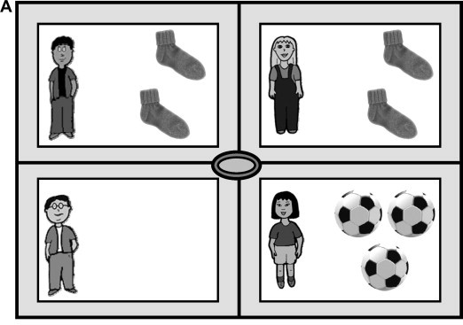
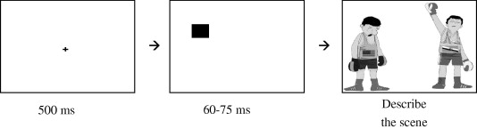

\pagestyle{fancy}
\lhead{}
\fancyhead[R]{UCL Linguistics Short Courses 2024}

Research on eye movements in reading has a history of more than a century. In contrast, eye movements have only started to become a popular measure in studies of spoken language processing within the last couple of decades. In these studies, participants' eye movements to a visual display are recorded as they follow instructions, listen to sentences, or generate utterances about the "visual world". The visual world paradigm allows researchers to study real-time language comprehension and production in natural tasks. Today we will first talk about components of the visual world paradigm, before discussing (only a fraction of) the most classic or interesting research questions that it has been used to address. 

# The visual world paradigm

In a typical visual world experiment, the participants hear (or produce) an utterance while looking at an experimental display, while their eye movements are recorded for later analyses. 

## The visual display

Typically, the visual display includes the object(s) mentioned in the utterance as well as a few distractors. The visual display can take the form of a semi-realistic scene, an array of objects, or even printed words. The visual display is typically presented 1-2 seconds before the onset of the utterance (preview time) and stays in view until the offset of the auditory stimuli. In some versions of the visual world paradigm, the visual display can be presented first, and a spoken sentence follows while a blank screen is shown. Such a setup is useful in the studies of short-term memory in language comprehension. 

{width=75%}

## The task

The spoken utterances can be instructions to the participants ("Pick up the/Click on the...") or simply descriptions or comments on the visual display, which distinguish an action-based version of the visual world paradigm and its non-action-based counterpart. In the latter case, participants are usually instructed to look at the screen and to listen carefully to the sentences. 

One advantage of the visual world paradigm compared to other psycholinguistic paradigms such as lexical decision or grammaticality judgments is that the listeners do not have to perform meta-linguistic judgments, which may be difficult in populations such as young children. 

## The linking hypothesis

Data collected in a visual world experiment is essentially the gaze position at particular time points in each trial. How to link these position data with language processing? (Because you may realise that eye movements are not as simple as "we always look at what's mentioned".) The assumption that provides the link between language processing and eye movements in the visual world is essentially that **the activation of a linguistic representation determines the probability that a participant will shift attention to the corresponding picture and thus make a saccadic eye movement to fixate it**. Therefore, when gaze positions are averaged across multiple trials, researchers can calculate the proportion/probability of looks to the target object, representing activation of the target lexical item^[When you read visual world eye-tracking papers, remember to pay attention to whether the researchers have applied a time shift to their data. It is well established that programming a saccadic eye movement takes approximately 200ms [@matin1993saccadic]. This means that any alterations in eye movements attributable to changes in activation levels are observable only after this 200ms interval. Hence, some visual world researchers opt to adjust the timestamps in their data by 200ms to better align the data with the activation levels. This used to be somewhat popular around a decade or two ago. So when you read a visual world eye-tracking paper, read their figure captions to find out whether they've shifted time. ]. 

{width=45%}

# Word recognition in the visual world

## Parallel activation during word recognition: Allopenna et al. (1998) @allopenna1998tracking {-}

Allopenna et al. @allopenna1998tracking had participants follow spoken instructions to pick out objects shown on the screen (e.g. "Pick up the beaker."). Four objects were shown on the screen: the referent (beaker), a cohort (beetle), a rhyme (speaker), and an unrelated object (carriage). Allopenna et al. observed a rising curve for the probability of fixating on the referent, and a rising-then-falling curve for the probability of fixating on phonologically overlapping objects (the cohort and the rhyme). This provides evidence for a continuous lexical access model during spoken word recognition where all candidates that are temporarily consistent with the speech signal are activated before the speech signal provides enough information to identify the single correct lexical item. 

# Sentence processing in the visual world

## Eye movements induced by sentence processing: Cooper (1974) @cooper1974control

One of the first classic studies of spoken language in the visual world was by Roger Cooper. Cooper @cooper1974control tracked participants' eye movements as they listened to stories while looking at a display of pictures. He found that participants initiated saccades to pictures that were named in the stories, as well as pictures that were associated with words in the story (Africa - lion, zebra, snake). Moreover, fixations were often generated before the end of the word. This provides important evidence that visual attention is highly correlated with spoken sentence processing. 

{width=30%}

## Effects of the visual context: Tanenhaus et al. (1995) @tanenhaus1995integration

To fully understand any visual world experiment, we need to be aware that the visual display itself may have an effect on how the listeners interpret the sentence. Tanenhause et al. @tanenhaus1995integration is one of the most classic studies that demonstrate this. Tanenhaus and colleagues presented participants with sentences such as “Put the apple on the towel in the box”, where the first prepositional phrase (“on the towel” in the example) is temporarily ambiguous between denoting the destination of the apple or its current location. In the one-referent condition of the experiment, participants saw just one apple on a towel, an empty towel, a box, and a pencil. In the two-referent condition there were two apples: one on a towel and one on a napkin. In this condition, a modifier was needed to inform the listener which of the two apples should be moved. They found that there were significantly more early looks to the empty towel in the one-referent than in the two-referent condition; which shows that listeners were more likely to initially interpret "on the towel" as the destination in the one-referent condition, but they were more likely to initially interpret it as the modifier in the two-referent condition. This is strong evidence that listeners can use visual information immediately to disambiguate sentence structures. This line of research shows that language processing is subject to a broad range of linguistic as well as non-linguistic constraints. 

{width=55%}

## Syntactic ambiguities: Snedeker and Trueswell (2004) @snedeker2004developing

Yesterday we talked about syntactic ambiguities and the serial vs. parallel processing hypotheses of syntactic ambiguity. One issue in syntactic ambiguity is lexical bias: e.g. the verb *remember* tends to be followed by a direct object (*remembered the story*) while the verb *suspect* tends to be followed by a sentence complement (*He suspects the story is false.*). 

Snedeker and Truswell @snedeker2004developing demonstrated this lexical bias in syntactic parsing using the visual world paradigm. Participants listened to sentences whose verb had either a modifier bias, an instrument bias, or neutral (e.g. Choose/Tickle/Feel the frog with the feather) while looking at visual displays of four objects: a target instrument (a feather), a target animal (a frog holding a feather), a distractor instrument (a candle), and a distractor animal (an animal holding a candle). In the one-referent condition, the distractor animal is different from the target animal (a leopard holding a candle) while in the two-referent condition, the distractor animal is the same as the target (a frog holding a candle). 

{width=35%}

Results showed that both the visual context and the lexical bias affected listeners' eye movements (in an additive manner). One referent scenes, as compared with two referent scenes, increased measures of the instrument interpretation and decreased measures of the modifier interpretation. Likewise, as the tendency of the verb to appear with an instrument phrase increased, measures of an instrument interpretation increased and measures of a modifier interpretation decreased. On the issue of lexical bias in syntactic ambiguity, these results clearly show that lexical bias has an influence on the initial syntactic structure comprehenders build for ambiguous sentences. On top of this, these results also show that the visual context has an effect on the initial interpretation of these sentences. 

## Incrementality in sentence processing

Yesterday we covered some reading eye-tracking studies that addressed incrementality in sentence processing. A line of studies also addresses this using the visual world paradigm.

### Altmann & Kamide (1999) @altmann1999incremental {-}

{width=40%}

Altmann and Kamide @altmann1999incremental presented listeners with visual displays showing, e.g., a boy, a cake, and some toys, while the listeners heard sentences such as "The boy will eat/move the cake.". Eye movements revealed that listeners were more likely to look at the target object (cake) prior to its onset when the verb was constraining (eat) than non-constraining (move). 

{width=60%}

This suggests that not only did listeners interpret the verb and its selectional information immediately after hearing it (incrementality), but they also used the selectional information in the verbs such as eat to actively anticipate what will be referred to next. This phenomenon is later known as prediction during language comprehension. 

Similarly, Kamide, Altmann, and Haywood @kamide2003time explored whether verb information can be combined with information conveyed by their grammatical subject to drive anticipatory eye movements. They found increased fixations to a motorbike when listeners heard sentences such as "The man will ride..." and increased fixations to a carousel when they heard "The girl will ride...". This shows that different sources of information can be efficiently combined on the fly during language comprehension to generate predictions of upcoming language constituents. 

### More on prediction {-}

A good number of studies have investigated what types of information are involved in predictive processing during language comprehension. I will expand a bit on this (because this happens to be what I work on). On the input side of prediction, a wide array of information including real-world knowledge as well as linguistic knowledge has been shown to contribute to predictive processing, including linguistic markers of tense [@altmann2007real], gender [@lew2007young; @lew2010real; @stone2021interaction], case [@kamide2003integration], number [@lukyanenko2016cookies], and noun class [@kwon2017predicting; @chow2020predicting]; certain phonological patterns [@ito2008anticipatory]; as well as sentential and/or discourse context [@altmann1999incremental; @otten2008discourse; @van2005anticipating], and event knowledge [@chow2016bag; @kamide2003time]. 

For example, Altmann and Kamide @altmann2007real found that upon hearing "The man will drink...", listeners showed anticipatory looks to a full glass of beer; while upon hearing "The man has drunk...", listeners looked instead at an empty wine class. 

Ito and Speer @ito2008anticipatory showed that listeners were quicker to look to a referent when a contrastive pitch accent was congruous with the contrast ("Find the blue ball. Now, find the GREEN ball.") than when it was neutral or incongruous ("...the green ball/the green BALL."). 

On the other side of predictive processing, researchers have been investigating what exactly we predict about the upcoming language: do we just form a vague, conceptual idea about the target, or do we predict a precise lexical item including its phonological or orthographical form? Research has shown that prediction includes semantic features of the target [@federmeier1999rose]; but it's a bit more controversial whether we (regularly) make predictions as detailed as the target word's phonological/orthographical form [@delong2005probabilistic; @nieuwland2018large].

## Pragmatic inferencing 

### When do we derive scalar implicatures? @huang2009online, @huang2011logic

One of the strengths of the visual world paradigm is that eye movements are constantly recorded, thus we do not need to rely on participants' responses to a target or critical word (i.e. we know what happens before and after the critical word). This means that with the visual world paradigm, we get insights into not only that something happens, but also when it happens. 

In a series of studies that investigated the time-course of scalar implicatures, Huang and Snedeker @huang2009online, @huang2011logic asked participants to listen to utterances such as “Point to the girl that has some of the socks” while viewing a display in which one girl had two of four socks and another girl had three of three soccer balls (a phonological onset overlap competitor). The lexical semantics of “some” denote a quantity greater than one (i.e., some-and-possibly-all), but the word is usually interpreted with an ‘upper boundary’ (i.e., some-and-not-all). Linguistic theories argue that the meaning of "some" includes the meaning of "all" by default while the implication of "some" meaning "not all" is derived later as an inference. Indeed, eye movements showed that "some" is initially interpreted as compatible with "all" (looks to the girl with two socks did not exceed those to the girl with three/all soccer balls upon presentation of "some"), and participants only started to exclude referents compatible with "all" approximately 800ms later. 

{width=35%}

{width=65%}

# Speech production in the visual world

Visual world eye-tracking has been informative about speech production as well. For example, Gleitman et al.  @gleitman2007give used the visual world paradigm to investigate the interaction between visual attention and utterance generation. They manipulated participants' initial attention to different characters on the visual display by presenting a brief, non-perceivable visual cue at the position of one of the characters before the onset of the visual display. This resulted in more first fixations to the cued rather than non-cued characters. Speech production results showed that participants were more likely to mention the cued character first, and subsequently alter their choice of verb ("to chase" vs. "to flee") or their syntactic structure (active vs. passive). Based on these results, the authors argue against a conception-first, speech-thereafter model, and conclude that visual attention and the generation of linguistic representation may be highly integrated. 

{width=65%}

# Summary

Over the last couple of decades, the visual world paradigm has allowed us to gain much insight into spoken language processing as well as speech production. Although the visual world paradigm has its limitations (e.g. the visual contexts can affect language processing in several ways), it continues to be a popular tool for researchers interested in spoken language for its ability to assess the time course of language processing and its ability to address the interplay of language, vision, and attention. 

# Read more on this... {-}

Huettig, F., Rommers, J., & Meyer, A. S. (2011). Using the visual world paradigm to study language processing: A review and critical evaluation. *Acta Psychologica*, 137(2), 151-171.

Tanenhaus, M. K. (2007). Eye movements and spoken language processing. In *Eye Movements* (pp. 443-II). Elsevier.