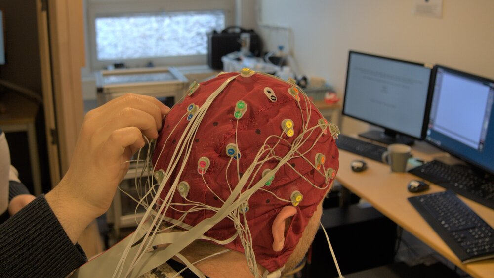
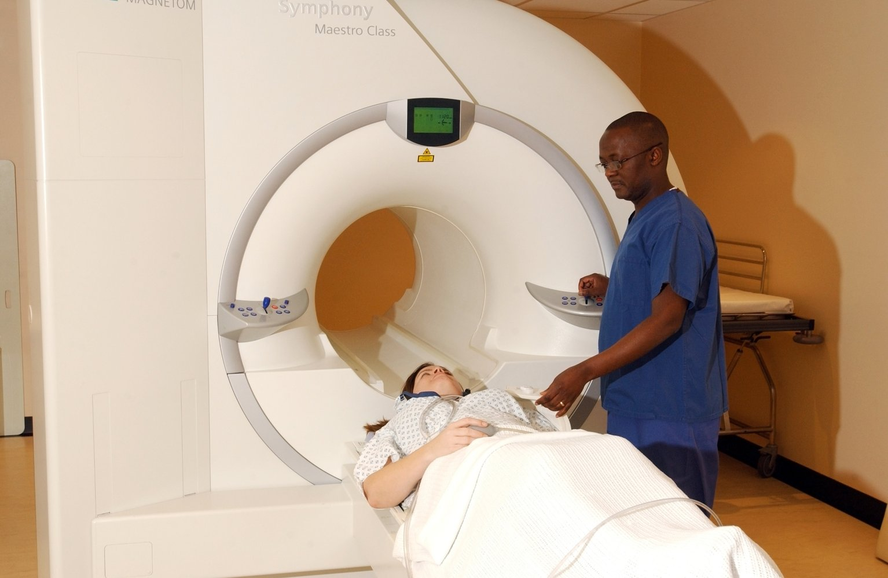
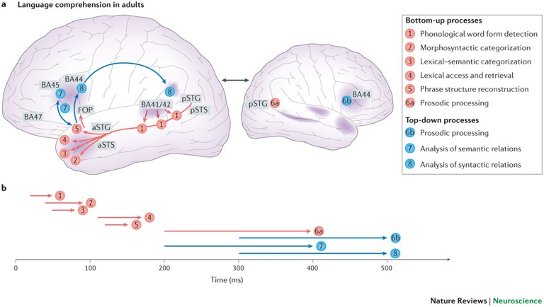
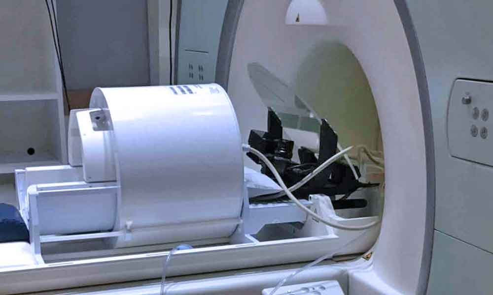
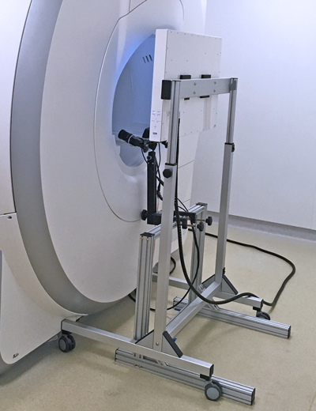
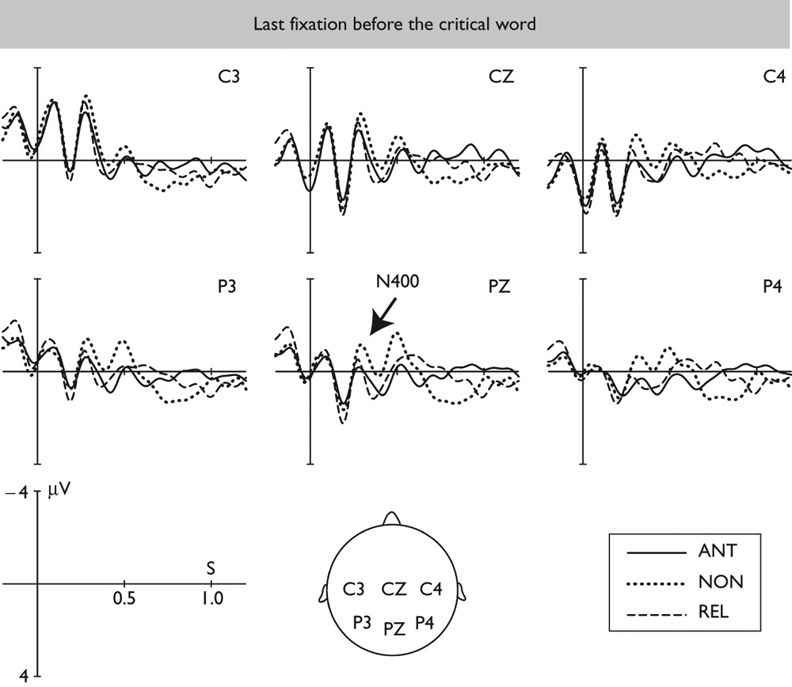
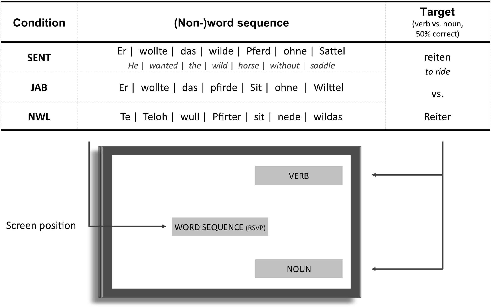
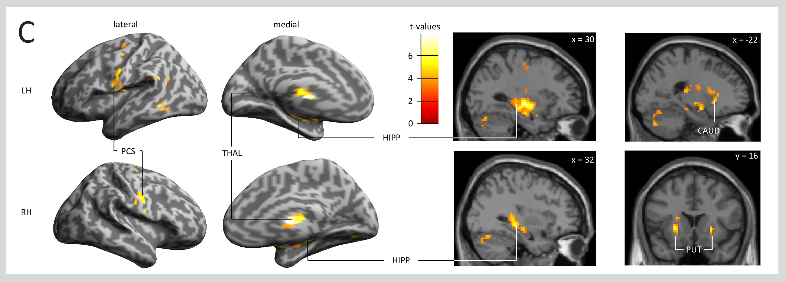

\pagestyle{fancy}
\lhead{}
\fancyhead[R]{UCL Linguistics Short Courses 2024}

# Neuroimaging in language research: an overview

## Electroencephalography (EEG) and Event-related potentials (ERPs)

**Electroencephalography** (EEG) is a method to record spontaneous **electrical activity of the brain**. Typically, electrodes are placed on the scalp to detect electrical signals generated by groups of neurons in the underlying brain tissue. EEG has a **high temporal resolution**: it can provide neural activity data on the millisecond scale. In other words, EEG is very good at providing information about *when* a neural response occurs. However, its **spatial resolution is low**: due to distortions of the electrical signal by intermediary tissues and bones, EEG only provides very limited information about *where* the neural response originates. As a **non-invasive** neural imaging method, EEG is widely used in the clinic (e.g. for monitoring epilepsy) as well as research. 

{width=40%}

**Event-related potentials** (ERPs) refers to EEG signals time-locked to the onset of an *event*, typically the presentation of a stimulus. It is one of the ways to process EEG data. On average, an ERP response to a stimuli consists of several **components**, each having different polarity, latency, and amplitudes. ERP components are typically named using its polarity and its occurring order or its latency. For example, the P2 refers to the second positive-going component after event onset, while the N400 refers to the negative-going component occurring at around 400ms after event onset. 

{width=40%}

The N400 is an ERP component associated with lexical or semantic processing. A well-documented finding is that words that are incongruent or unexpected in context (e.g. *socks* in (\ref{coffee2})) elicit a larger N400 response than congruent or expected words (*sugar* in (\ref{coffee1})) [@kutas1980reading; @kutas1984brain; @federmeier1999rose]. This robust N400 effect is repeatedly replicated in research, and is now widely interpreted as evidence of contextual facilitation, where constraining context results in reduced processing effort when predictable words are encountered. 

```{=latex}
\begin{exe}
\ex
\label{coffee}
\begin{xlist}
\ex
\label{coffee1}
I take coffee with cream and \textit{sugar}. \\
\ex
\label{coffee2}
I take coffee with cream and \textit{socks}. \\
\end{xlist}
\end{exe}
```

## Functional Magnetic Resonance Imaging (fMRI)

**Magnetic Resonance Imaging** (MRI) is an imaging technique used to generate pictures of the anatomy and the physiological processes inside the body. MRI relies on strong magnetic fields, typically ranging from 1.5T to 13T^[300–2600 times the magnetic field generated by a typical fridge magnet.]. This magnetic field causes hydrogen protons in body tissues to align (spin in the same direction). When radio frequency (RF) pulses are applied, the protons are briefly excited and then emit signals as they return to their equilibrium state. By capturing these signals, MRI generates images that differentiate between tissues based on their varying hydrogen content, allowing for clear contrasts in the resulting scans. MRI is a **non-invasive** imaging technique that does not harm the body^[This is true in neuroimaging, where MRI is used to measure brain anatomy and blood flow that naturally provide imaging contrasts. However in some other medical applications, contrast agents are needed, which can posit a rick for the patient.]. It has a very high spatial resolution, as well, providing images on the millimetre scale. 

{width=40%}

**Functional Magnetic Resonance Imaging** (fMRI) is a way to acquire MRI images that measures **blood-oxygen-level dependent** (BOLD) signals. This can provide an (indirect) measure of neural activity: when a brain region is activated, it calls for more blood flow to that area, resulting in a temporary abundance of oxyhaemoglobin which can be picked up by the scanner. fMRI preserves the **high spatial resolution** of MRI, providing data on the millimetre to centimetre scale. It is also sensitive to deep tissues of the brain, unlike EEG which can only pick up cortical respoonses. On the down side, fMRI has **poor temporal resolution**, as blood reactions are slow, on the seconds scale. 

You might have heard of **Broca's area**, which is a region in the frontal cortex identified by fMRI studies to be involved in language processing, especially during complex processing of the language input's structure (syntax and semantic compositions). Years of fMRI research has sketched out the language network in the human brain, which is typically left-lateralised, and includes areas such as BA44/45 (Broca's area), BA47, the anterior and posterior superior temporal gyrus and sulcus (aSTG, aSTS, pSTG, pSTS). 

{width=65%}

# Eye movement data vs. Neuroimaging data

Experimental research benefits from the **complementarity** of multiple research methods: each method has unique strengths and limitations, so findings derived from combining methods are often more robust than those from a single approach. Eye-tracking data, for instance, can be interpreted alongside EEG or fMRI results to strengthen a hypothesis.

For example, both eye-tracking and EEG evidence support the idea that comprehenders use context to anticipate upcoming words in highly predictive sentences, such as, “*They wanted to make the hotel look more like a tropical resort. So along the driveway, they planted rows of palms.*” For such sentences, visual world eye-tracking shows that comprehenders often make anticipatory saccades towards the target object (*palm*). Meanwhile, EEG data reveal reduced neural responses (e.g., smaller N400s) to expected words compared to unexpected ones, indicating that predictable words are easier to process. Together, these results provide converging evidence that context facilitates the processing of highly predictable words.

# Co-registration of eye movements and neuroimaging data

Recently, advances in technology has allowed researchers to directly combine eye-tracking and neuroimaging^[For EEG, the primary technical difficulty was data synchronisation. Eye-trackers and EEG recordings typically operate on slightly different timescales, making it difficult to align the two data streams. This is recently overcome by advanced signal acquisition methods. For fMRI, the primary difficulty was the equipment: no regular metals can be near the MRI scanner. This is overcome by long-range eye-tracking techniques and equipment made completely of paramagnetic materials such as aluminium and titanium.]. In this case, eye movement data serves as an index of *what* is being processsed, and neuroimaging provides detailed data on *how* the brain is processing the visual information. 

## Eye-tracking with EEG

#### Limitations of the Rapid Serial Visual Presentation (RSVP) Method in ERP Experiments{-}

Traditional ERP (event-related potential) experiments often utilize the **rapid serial visual presentation** (RSVP) method. In RSVP, participants sit in front of a display that presents one word at a time at a fixed interval, known as the stimulus onset asynchrony (SOA). However, as you may have gathered, **RSVP differs significantly from natural reading experiences**, posing some limitations in terms of ecological validity.

In a typical RSVP setup, each word is displayed for 500-1000 milliseconds—much longer than the duration of an eye fixation in natural reading. This **prolonged exposure** may influence participants' responses to the words in ways that don’t reflect natural reading processes. Additionally, RSVP **restricts natural eye movement patterns**, such as word skipping and regressive saccades. Furthermore, unlike natural reading, where readers benefit from parafoveal preview, RSVP **does not allow parafoveal preview**, which may further impact comprehension and processing.

![A schematic illustration of the traditional RSVP method and the co-registration approach, extracted from [@himmelstoss2020co]. \label{rsvp}](img/himmelstoss2020rsvp.jpg){width=70%}

#### Co-Registration of Eye Movements and EEG{-}

Co-registering eye movements with EEG offers a promising solution to the limitations of the RSVP method. Instead of analysing event-related brain activity time-locked to an externally triggered stimulus onset as with RSVP, co-registration allows researchers to investigate brain activity in response to naturally occurring fixations. This approach is useful for studying real-time processing during visual search tasks, naturalistic scene viewing, and, importantly, reading.

In eye-tracking EEG co-registration, the equivalent of event-related potentials (ERPs) is known as **fixation-related potentials** (FRPs). Research has shown that FRPs produce results similar to those of conventional ERPs, though some neural signals may appear earlier in FRPs than in ERPs [@dimigen2011coregistration]. 

{width=45%}

## Eye-tracking with fMRI

#### Event-related fMRI{-}

Unlike ERPs, which are by far the most popular EEG analysis technique in language research, event-related fMRI has faced challenges in gaining widespread use. One primary reason is fMRI’s relatively poor temporal resolution: hemodynamic responses to events are slow, taking several seconds to reach the peak, which makes experiment design and data analysis more complex. As a result, many fMRI studies have traditionally relied on block designs, in which the experimenter manipulates conditions across blocks of stimuli (e.g., reading a science-fiction novel vs. a news article). In block designs, fMRI data are pooled across each block and then compared between blocks.

With advances in data processing, however, event-related fMRI has evolved, allowing researchers to analyse brain region activation in response to specific events. Similar to ERP studies, early event-related fMRI experiments often used the rapid serial visual presentation (RSVP) method, facing similar limitations in ecological validity.

#### Co-Registration of Eye Movements and fMRI{-}

Although natural reading tasks are common in fMRI block designs, eye movements have limited utility in this context, as fMRI data is often pooled across the entire reading period. Since adding eye-tracking to an fMRI setup is relatively low-cost for labs already equipped with fMRI (an expensive technology to operate and maintain), some researchers initially used eye-tracking simply to monitor participants' attention during experiments. While eye movement data could be compared with fMRI outcomes, no direct way existed to link the two in a block design. As a result, early eye-tracking-fMRI co-registration gained limited interest.

This changed significantly with the advent of event-related fMRI. Again thanks to advancements in data processing, researchers can now design event-related fMRI studies with highly natural tasks, where eye movements serve as markers for modeling haemodynamic responses. This approach allows fMRI data to be aligned with naturally occurring visual events, producing what is known as **fixation-related fMRI** [@zhou2017neuroimaging; @himmelstoss2020co].

```{=latex}
\begin{figure}
\centering
\begin{minipage}{.6\textwidth}
  \centering
  \includegraphics[width=.9\linewidth]{img/fmri-meg-eyelink-eye-tracker.jpg}
  \caption{Part of an eye-tracking-fMRI co-registration setup. Extracted from sr-research.com.}
  \label{eye-fmri1}
\end{minipage}%
\begin{minipage}{.4\textwidth}
  \centering
  \includegraphics[width=.9\linewidth]{img/aluminum-uberstand.jpg}
  \caption{An aluminium accessory for an eye-tracking-fMRI co-registration setup. Extracted from sr-research.com.}
  \label{eye-fmri2}
\end{minipage}
\end{figure}
```

<!-- {width=50%}

{width=50%} -->

# Case: In Search of Prediction during Language Processing

## FRPs and the Effect of Predictability in Visual Word Recognition

Reading eye-tracking has long documented that words that are highly predictable in a context are read more quickly, and are more likely to be skipped [@rayner2009eye]. In neuroimaging, it is also well documented that highly predictable words elicit smaller brain responses compared to unpredictable words, indicating reduced processing difficulty [@van2012prediction]. However, a key question remains: Do the benefits of predictability stem from rapid context-based *integration of a word* *after it is encountered*, or from *pre-activation* of the word’s meaning *before it is seen*? This is also known in some literature as the *prediction vs. integration debate* [@kutas2011thirty]. 

<!-- (e.g. Balota, Pollatsek, & Rayner, Citation1985; Ehrlich & Rayner, Citation1981; Hawelka, Schuster, Gagl, & Hutzler, Citation2015; Kliegl, Grabner, Rolfs, & Engbert, Citation2004; Kliegl, Nuthmann, & Engbert, Citation2006; Rayner, Binder, Ashby, & Pollatsek, Citation2001; Rayner & Well, Citation1996).  -->

Intuitively, to determine whether readers actively predict words, we should examine brain responses that occur *before* encountering these words. Here, fixation-related potentials (FRPs) can offer some new insights. 

In a study by Kretzschmar and colleagues [@kretzschmar2009parafoveal], participants read sentences with highly constraining contexts made of antonyms (*The opposite of black is...*), ending either with the expected word (*...white*), an unexpected but semantically related word (*...green*), or an unexpected and unrelated word (*...cold*). Upon the first fixation on the target word (*white/green/cold*), the researchers observed the classic N400 effect: brain responses were smallest for the expected word, larger for the related but unexpected word, and largest for the unrelated word.

Crucially, the researchers also analysed the last fixation prior to the target word, when participants were fixating on the prior region (*black is*) but could parafoveally preview the upcoming word. Here, they also observed an N400 effect: the unrelated word (*cold*) elicited larger brain responses—indicating greater processing difficulty—than the expected or related words (*white* or *green*). This finding is significant because, at this stage, readers had not yet begun lexical processing of the target word. Thus, the effect likely reflects a parafoveal mismatch between the *pre-activated*/*predicted* lexical features and the target word, supporting the idea that readers engage in active, context-based prediction.

{width=60%}

## Fixation-related fMRI and the Neural Basis of Syntactic Predictions

Prediction during language comprehension is one of the most popular topics on language processing. This is partially because predictive processing is believed to be a fundamental principle of brain function [@bar2011predictions], and some theoretical frameworks propose that this is fundamentally how cortical neurons work (*predictive coding*, [@friston2005theory]). If this is true, we should be able to find evidence for prediction in all aspects of our brain functions, including language processing. 

Bonhage and colleagues [@bonhage2015combined] used a combined eye-tracking and fMRI approach to explore the neural basis of linguistic predictions. They designed a "predictive eye gaze reading task" in which sentences were presented word-by-word on a screen up to the pre-final word. The final word was displayed after a short delay. Importantly, the spatial position of the final word on the screen was associated with its grammatical category: for instance, verbs always appeared at the top and nouns at the bottom of the screen.

Through this setup, participants could learn the association between grammatical category and spatial location. Once this association was established, they were likely to initiate a predictive eye movement toward the anticipated location as soon as they made a syntactic prediction.

{width=60%}

The study included three conditions: Sentence, Jabberwocky (grammatical sentences with content words replaced by pseudowords), and Non-word lists (ungrammatical strings of non-words). Eye movement results indicated that participants were more likely to make predictive eye movements toward the region associated with the correct grammatical category in both the Sentence and Jabberwocky conditions, compared to the Non-word lists condition. This suggests that syntactic structure, even without meaningful content words, can trigger predictive eye movements.

fMRI data time-locked to these predictive eye movements highlighted brain regions associated with syntactic predictions, including the premotor cortex, thalamus, caudate nucleus, hippocampus, and cerebellum. These areas are commonly linked to the detection and processing of sequences, as well as the mapping of sequential input onto structured linguistic templates. The involvement of regions responsible for sequential information in predicting upcoming language input is compatible with the predictive coding framework [@friston2009predictive]. 

{width=70%}

# Further readings {-}

Himmelstoss, N. A., Schuster, S., Hutzler, F., Moran, R., & Hawelka, S. (2020). Co-registration of eye movements and neuroimaging for studying contextual predictions in natural reading. *Language, Cognition and Neuroscience*, 35(5), 595-612.